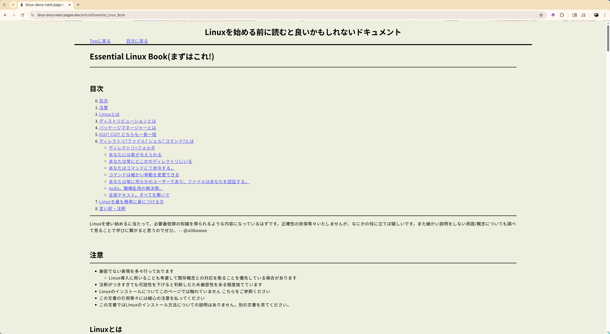
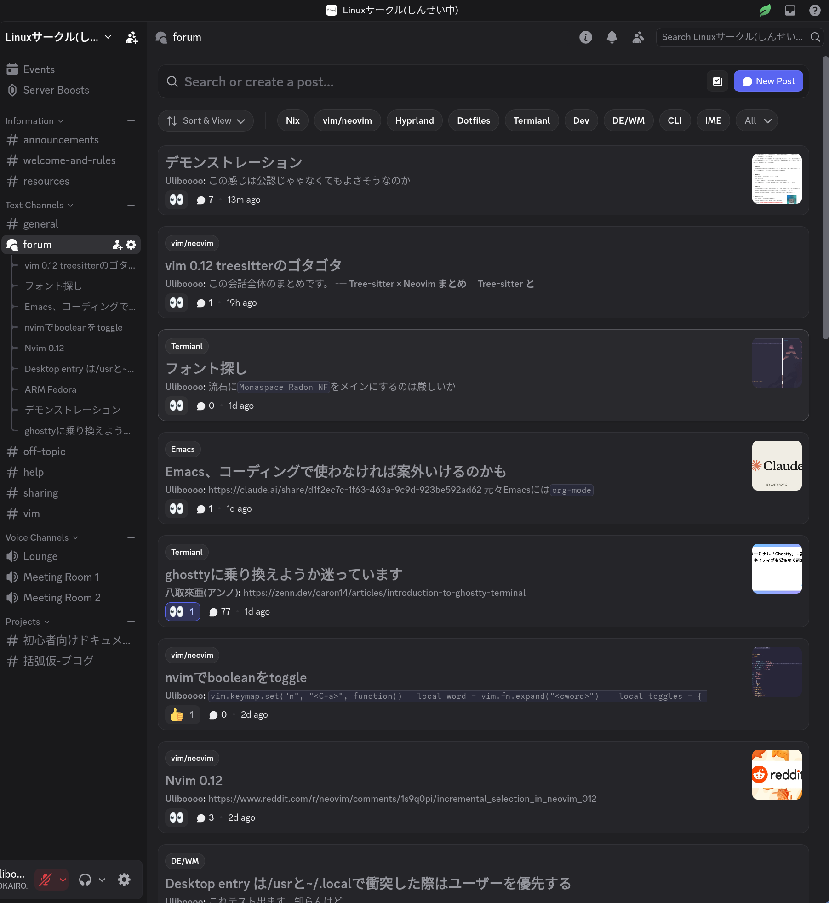
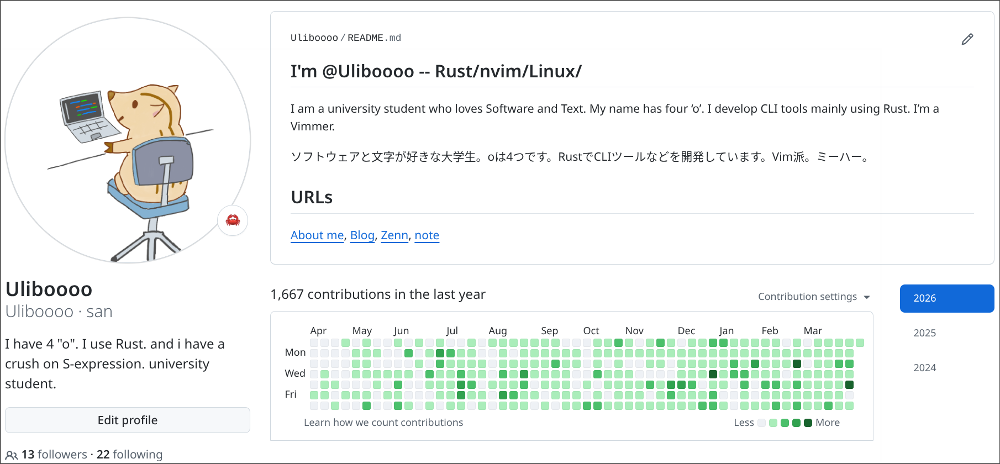
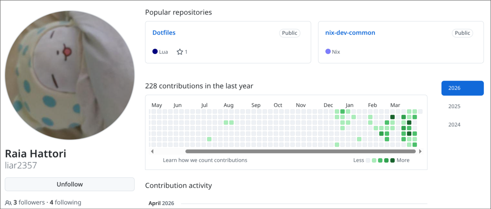
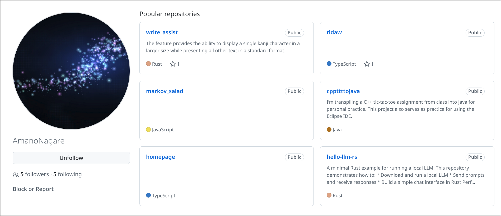
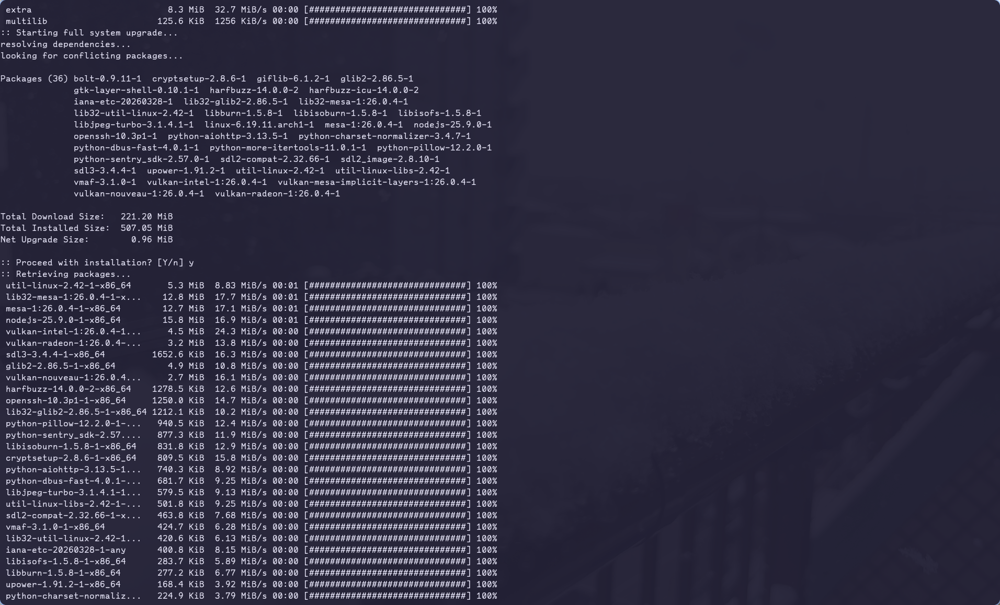
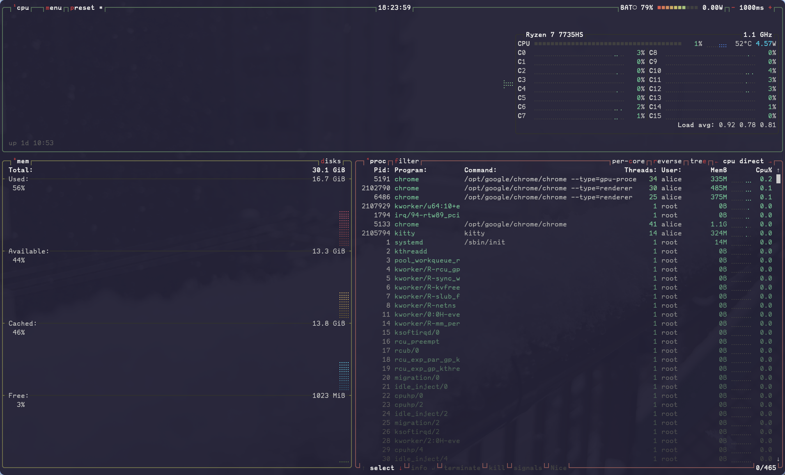
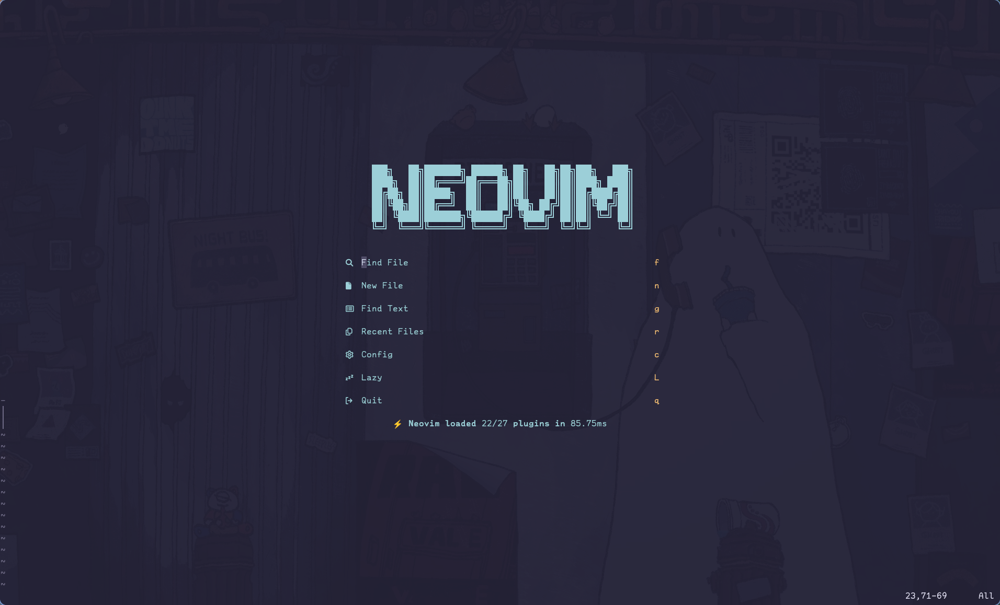
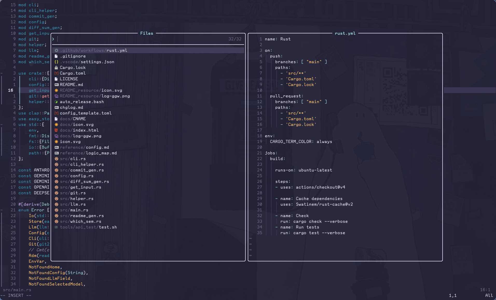

注意?
===

<!-- font_size: 2 -->
スライド内部でDiscordへの招待リンクなどがあります。

今入らなくてもスクショだけでも撮っていただけると便利です。

---

活動内容について
===

<!-- speaker_note: this is a speaker note -->

<!-- font_size: 2 -->
我々の活動目的と内容は
<!-- pause -->
<!-- font_size: 4 -->
<!-- alignment: center -->
デスクトップOSとしてのLinuxの普及

<!-- pause -->

<!-- font_size: 2 -->
<!-- alignment: left -->
それを実現するための
<!-- pause -->
<!-- alignment: center -->
<!-- font_size: 3 -->
- 初学者向けドキュメントの開発
- Linuxに関する知見の共有

<!-- pause -->
<!-- alignment: right -->
<!-- font_size: 2 -->
です

---

そもそも、Linuxとは?
===

<!-- pause -->
<!-- font_size: 3 -->
- macOS, Windowsなどに並ぶ**OS**の1つ
- ソースコードが公開されている = OSS
- Linuxは世界中の開発者によって開発されている

<!-- new_lines: 2 -->
<!-- pause -->
<!-- font_size: 2 -->
なんて読むのか...?

<!-- pause -->
<!-- font_size: 2 -->
<!-- alignment: left -->

=> 公式には定められていない。
<!-- alignment: center -->
<!-- new_lines: 0 -->
<!-- font_size: 3 -->
"リナックス"が日本で標準的
<!-- font_size: 2 -->
<!-- new_lines: 0 -->
他にはリヌックスやライナックスなどもある

---

デスクトップOSとしてのLinux
===

<!-- font_size: 2 -->
パソコンを買う時に"Windows搭載"などの宣伝文句は見かける

<!-- pause -->
<!-- font_size: 3 -->
=> "Linux搭載"は見かけることがない

<!-- pause -->
<!-- font_size: 2 -->
<!-- new_lines: 1 -->
それは...
<!-- pause -->
Linuxは主にサーバーで使われているため

<!-- pause -->
<!-- font_size: 3 -->
PC向けのOS(=デスクトップOS)としての知名度は低い

<!-- pause -->
<!-- font_size: 4 -->
<!-- alignment: center -->
我々の目標はこの**デスクトップOSとしてのLinux**を広めよう

---

なぜLinuxなのか
===

<!-- pause -->
<!-- font_size: 3 -->
広告や自社製品の押し売りが無い
<!-- 具体名こそ出しませんが、ユーザーのファイルを勝手にクラウドにbkして容量が足りないから
契約しろ? とかいうランサムに近い行為をしている有料OSがあるとかないとか? -->
<!-- font_size: 2 -->
-> Linuxの性質上、一社が独占的に何かを行うことが出来ない

<!-- pause -->
<!-- font_size: 3 -->
高いカスタマイズ性
<!-- font_size: 2 -->
-> macOSやWindowsでは変えることの出来ないOSのデザインまで自分で選び、作ることができる

<!-- pause -->
<!-- font_size: 3 -->
省リソース
<!-- font_size: 2 -->
-> 多くの場合、使用するRAMやCPUに関して少なくできる

---

実績
===

<!-- pause -->
<!-- font_size: 2 -->
実はまだ公認サークルではなく、申請中です
<!-- new_lines: 1 -->
とは言え、幾つかの実績はあります

<!-- pause -->
<!-- font_size: 3 -->
- 初心者向けドキュメントの公開
- コミュニティの発足

---

初心者向けドキュメントの公開
===

<!-- column_layout: [5, 1] -->

<!-- alignment: center -->
<!-- column: 0 -->

<!-- column: 1 -->

URL

<!-- reset_layout -->

まだアップデート中ですが主要なドキュメントは公開されているので、是非見てみてください

---

コミュニティの発足
===

<!-- pause -->
<!-- font_size: 2 -->
実質的な主な活動場所であるDiscrod上にコミュニティを作成しています。

<!-- column_layout: [4,2,1] -->

<!-- column: 0 -->
<!-- alignment: right -->

<!-- alignment: left -->
<!-- column: 1 -->

<!-- alignment: left -->
具体的には

<!-- alignment: left -->
- 新しいツールの共有
- おすすめの設定の共有
- 困った際の互助

<!-- font_size: 1 -->
などがあります
<!-- column: 2 -->

サーバー招待URL

<!-- font_size: 2 -->
<!-- alignment: left -->
上記のQRコードから
Discordにご参加ください

<!-- reset_layout -->

---

一部メンバーを紹介
===

<!-- column_layout: [1,1,1] -->

<!-- column: 0 -->
<!-- font_size: 2 -->
内山

<!-- font_size: 1 -->
さっきのドキュメントの文書を書いた人

<!-- column: 1 -->
<!-- font_size: 2 -->
武笠 善文

<!-- font_size: 1 -->
さっきのドキュメントのWeb機能を書いた人

<!-- column: 2 -->
<!-- font_size: 2 -->
天野 琉
<!-- font_size: 1 -->
オブジェクト指向と関数型指向にハマった人

<!-- reset_layout -->

---

おまけ
===

<!-- font_size: 3 -->
CLI(CUI)の普及もサブ目標

<!-- font_size: 2 -->
CLIとは`Command Line Interface`の略で、主にターミナル上で動作するUIを示す

<!-- column_layout: [1,1,1] -->
<!-- column: 0 -->
<!-- pause -->

<!-- column: 1 -->
<!-- pause -->

<!-- column: 2 -->
<!-- pause -->

<!-- reset_layout -->

<!-- pause -->
`Calude Code`などによりターミナルが再評価されている

CLIは作業の自動化の容易さや動作の軽快さから今でも開発者に愛されている

=> Linuxではターミナルを多用する => ならばLinuxの普及の1歩になる

---

おまけ2 Vim
===

<!-- font_size: 2 -->
Vim/Neovimというターミネルで動くエディタ

<!-- font_size: 2 -->
Linuxサークルのメンバーには利用者が多いです。もしVimについて興味あるよって方がいらしたら

<!-- column_layout: [1,1] -->
<!-- column: 0 -->

<!-- column: 1 -->

<!-- reset_layout -->

---

URLs
===

<!-- column_layout: [1, 1, 1, 1] -->
<!-- font_size: 2 -->

<!-- alignment: center -->
<!-- column: 0 -->

Discord

<!-- column: 1 -->

Linuxドキュメント

<!-- column: 2 -->

公式サイト

<!-- column: 3 -->

GitHub org

<!-- reset_layout -->

<!-- new_lines: 3 -->

<!-- font_size: 7 -->
Thanks!

---
